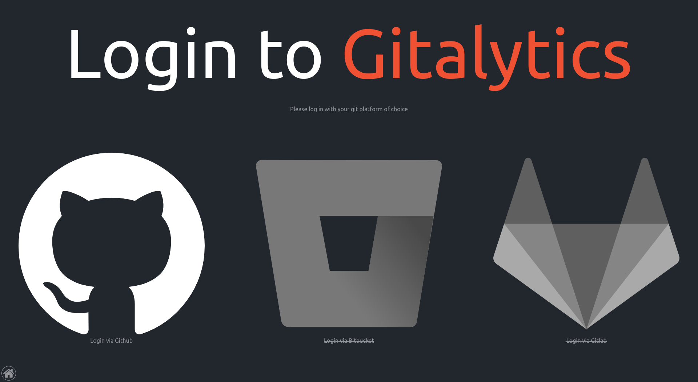

# Getting Started

first: go to our [login page](https://gitalytics.org/#/login)

here you can choose the git-provider of your choice

{: .important }
> currently there is only GitHub available.
>
> the Gitalytics-Team will soon work to include the other providers

after you have chosen your provider you are redirected to there page.
You have to login with your normal account (if you aren't already)
and then grant us access.

{: .note }
> If you want us to analyze different workspaces you either have to grant the access (if you're the owner) or request the access (if you're a member)
