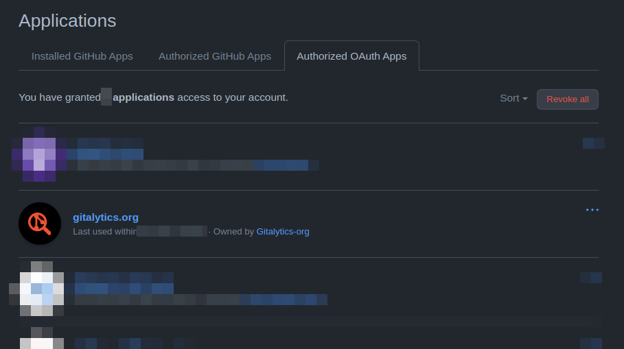
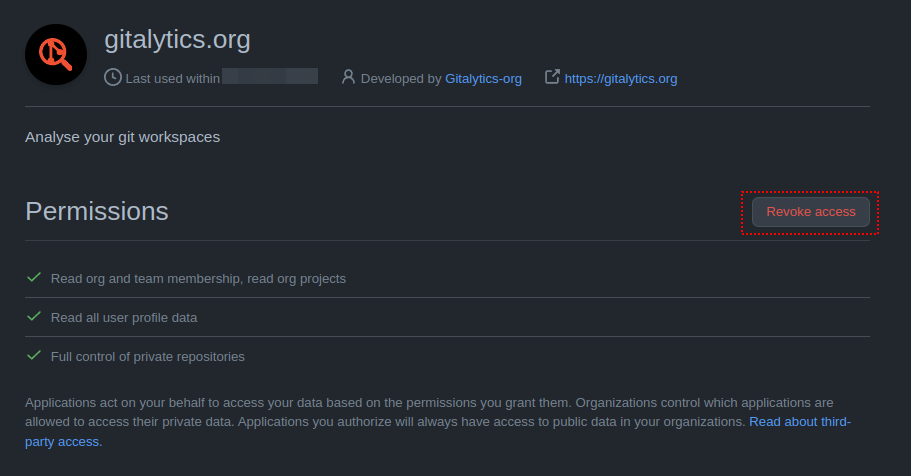

# How to remove our access to your account

`github.com > settings > applications > Authorized OAuth Apps > gitalytics.org`

[or directly here](https://github.com/settings/connections/applications/066d566863a226d661c7){:target="_new"}

